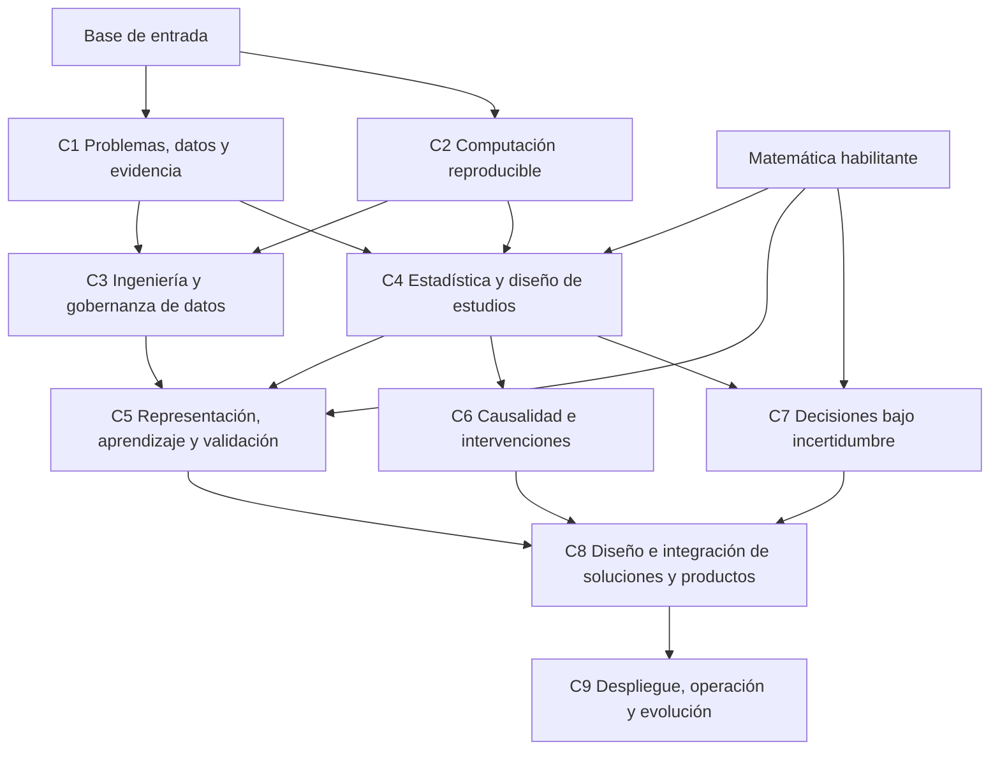

# 1. Convergencias entre las tres propuestas

Se compararon íntegramente `chatgpt.md`, `claude.md` y `gemini.md`, se inspeccionaron los 21 PDF de `curriculum/` y se volvió a sus contenidos pertinentes para resolver las discrepancias. Se conserva la jerarquía entre fuentes: los PDF son evidencia primaria; las propuestas son interpretaciones revisables. La coincidencia entre ellas permite localizar una cuestión compartida, pero no demuestra la validez de su solución.

Las tres propuestas convergen sustancialmente en seis puntos:

1. **Analytics conecta problemas, evidencia y acción.** La formulación y el contexto organizacional tienen entidad propia; no basta ajustar modelos a los datos disponibles.
2. **Las preguntas descriptivas, inferenciales, predictivas, causales y prescriptivas necesitan criterios diferentes.** Comparten métodos, pero una misma regresión no responde indistintamente todas esas preguntas.
3. **La ingeniería de datos pertenece a la formación común.** Calidad, integración y procedencia no pueden suponerse resueltas por otra profesión. Las tres rechazan reducirla a administración de infraestructura, aunque difieren en cuánto cumplen esa intención.
4. **La decisión requiere más que predicción y optimización.** Todas incluyen incertidumbre, simulación, objetivos y restricciones, y reconocen aportes de la organización y del juicio humano.
5. **La formación no termina al validar un modelo.** Productos, despliegue y mantenimiento aparecen en las tres; también se reconoce que un producto de datos excede un tablero.
6. **La responsabilidad y la reproducibilidad deben reaparecer.** Ninguna declara que ética, comunicación o documentación sean asuntos exclusivamente terminales. La diferencia está en su profundidad, sus responsables y la consistencia de esa transversalidad.

Hay, sin embargo, convergencias solo aparentes. “Ingeniería de datos” significa principalmente semántica y flujos confiables en ChatGPT, un escalón posterior a programación y descripción en Claude, y una extensa arquitectura distribuida temprana en Gemini. “Predictiva” incluye aprendizaje no supervisado en los tres, aunque agrupar o representar observaciones no implica necesariamente predecir. “Producto” se diseña antes de la operación en ChatGPT, pero recibe una solución ya desplegada en Claude y, en gran parte de su descripción, en Gemini. “Prescriptiva” nombra tanto comparación razonada de alternativas como repertorios muy extensos de optimización y control.

Tampoco es equivalente declarar un tema transversal y asignarle progresión verificable. Claude añade una consolidación ética específica; ChatGPT distribuye responsabilidades entre cursos; Gemini distribuye numerosas técnicas de protección y auditoría, algunas muy especializadas. La síntesis conserva las competencias compartidas y vuelve a decidir su ubicación, alcance y dependencia.

# 2. Divergencias principales

Los códigos D1–D11 identifican las controversias que se resuelven en la sección siguiente. Los números de curso de esta comparación pertenecen a cada propuesta original, no a la arquitectura canónica.

| Cuestión | ChatGPT | Claude | Gemini | Pregunta curricular de fondo |
|---|---|---|---|---|
| **D1. Entrada computacional y matemática** | Ocho cursos; programación, álgebra, matrices y derivación como base externa de entrada. | Trece cursos; programación y manejo de datos como curso 2; matemáticas externas antes de estadística. | Siete cursos; programación básica y álgebra al inicio, cálculo y álgebra lineal antes de inferencia. | ¿Qué capacidades debe garantizar la cadena y cuáles puede reconocer como formación previa? ¿Cuándo son realmente necesarias? |
| **D2. Formulación, descripción y comunicación** | Las integra en el primer curso y las profundiza transversalmente. | Separa formulación, programación y descripción/comunicación en cursos 1, 2 y 4. | Integra formulación, preparación, exploración y comunicación en un primer curso técnicamente amplio. | ¿Cómo evitar una entrada puramente verbal sin sobrecargarla con toda la computación y la visualización? |
| **D3. Ingeniería de datos y escala** | Curso temprano acotado, con profundización operativa final. | Después de programación y descripción; vincula su inicio con datos grandes, múltiples o de mala calidad. | Segundo curso con SQL avanzado, procesamiento distribuido, captura de cambios, flujos continuos, orquestación y contenedores. | ¿La identidad de la ingeniería depende del volumen o de responsabilidades durables sobre datos y procesos? |
| **D4. Estadística y causalidad** | Dos cursos; causalidad depende de estadística, no de aprendizaje automático. | Dos cursos, pero causalidad exige primero aprendizaje supervisado. | Un único curso reúne probabilidad, inferencia, experimentación, causalidad, modelos jerárquicos y privacidad diferencial. | ¿Qué profundidad debe tener la atribución causal y qué conocimientos necesita realmente? |
| **D5. Extensión del aprendizaje automático** | Un curso de aprendizaje y validación; especializaciones avanzadas fuera del núcleo. | Dos cursos predictivos, con causalidad intercalada; el segundo reúne no supervisado, series temporales y aprendizaje profundo. | Un curso con un repertorio extenso de modelos, optimizadores y técnicas de explicación. | ¿Se organiza el núcleo por familias de algoritmos o por representación, generalización y validez de uso? |
| **D6. Decisiones y sus prerrequisitos** | Integra simulación, optimización y decisión después de predicción y causalidad, por una finalidad integradora explícita. | Exige estadística, predicción I, causalidad y predicción II antes de prescripción. | Exige inferencia/causalidad y predicción; incorpora además optimización estocástica, eventos discretos, bandidos y control. | ¿Aprender a formular decisiones necesita dominar previamente todas las formas de producir sus insumos? |
| **D7. Producto frente a operación** | Diseño e integración de producto antes de operación. | Despliegue entrega un sistema ya operando a productos. | Operación precede a productos en las descripciones; el último curso admite también antecedentes cursados en paralelo. | ¿Cuándo se definen usuarios, utilidad, aceptación y responsabilidades respecto del despliegue? |
| **D8. Ética, gobernanza y privacidad** | Transversales con anclajes en datos, productos y operación; no hay curso independiente. | Transversales más un curso 12 de consolidación, después de producto y despliegue. | Transversales; privacidad diferencial y otras técnicas especializadas se incluyen en el núcleo. | ¿Cómo asegurar profundidad sin convertir la responsabilidad en auditoría tardía o en un catálogo técnico? |
| **D9. Integración y alcance organizacional** | Cierre integrador en productos y operación, sin capstone adicional; adopción acotada. | Capstone independiente posterior a todos los cursos, con patrocinador real; productos incluye ecosistemas cuando corresponde. | Productos combina integración, liderazgo, plataformas, gobernanza y transformación organizacional; promete perfiles profesionales de alta responsabilidad. | ¿Hace falta otro curso para integrar y hasta dónde llega el perfil común frente a especializaciones organizacionales? |
| **D10. Red de prerrequisitos** | Dos bifurcaciones consistentes, seguidas de una convergencia obligatoria hacia decisiones. | Cadena casi lineal; el diagrama añade a ingeniería una dependencia de estadística que su ficha no exige. | El diagrama inicial es lineal; las fichas permiten ramas; el diagrama final pone prescripción y operación en paralelo, aunque la ficha de operación exige prescripción. | ¿Qué flechas expresan necesidad intelectual y cuáles solo un orden de presentación? |
| **D11. Profundidad, herramientas y matriz** | Principios durables; varias I subrepresentan el desarrollo del curso responsable y varias M se desplazan al cierre. | Mayor desagregación de cursos; identifica M con un lugar principal de dominio y repite I en temas transversales. | Gran especificidad de herramientas y numerosas M tempranas o avanzadas dentro de cursos muy amplios. | ¿Qué significa integrar una competencia y qué amplitud puede defenderse sin conocer la carga formativa? |

# 3. Evaluación de las divergencias contra la evidencia

Las páginas citadas son páginas del archivo PDF. Se distingue entre lo que una fuente documenta y la decisión de arquitectura que se infiere de ella. Los tres documentos INFORMS constituyen una familia relacionada, no tres votos independientes. Los programas profesionales aportan relevancia y contenido; sus listas no prueban suficiencia pedagógica ni eficacia comparada.

## D1. Garantizar una base computacional sin anticipar todos los requisitos matemáticos

`national-academies-data-science-for-undergraduates-2018.pdf`, pp. 42–43, distingue fundamentos matemáticos y computacionales y admite rutas que eviten cadenas convencionales innecesariamente largas. `acm-computing-competencies-undergraduate-data-science-2021.pdf`, pp. 112–119, concreta pensamiento algorítmico, programación, estructuras, modularidad, consultas y aspectos numéricos. `mit-professional-certificate-data-engineering.pdf`, pp. 9–10, comienza con programación y datos antes de arquitecturas más complejas.

**Resolución:** se retiene de Claude una base computacional explícita, pero se la orienta a computación reproducible y se permite reconocer equivalencias. Se modifica la entrada de ChatGPT: cálculo y matrices no bloquean formular preguntas o describir datos. De Gemini se retiene escalonar matemáticas antes de los cursos que las necesitan, sin suponer que una programación elemental habilite de inmediato toda la ingeniería distribuida. El núcleo tendrá un curso computacional común; la matemática habilitante será una condición explícita antes de la rama formal, no una barrera global al primer curso.

## D2. Integrar pregunta, descripción y comunicación; separar la formación computacional

`usc-introduction-to-data-analytics.pdf`, p. 1 y pp. 5–7, vincula preguntas, consulta y presentación visual sin prerrequisitos, aunque su contenido se concentra en bases de datos y herramientas. `national-academies-data-science-for-undergraduates-2018.pdf`, pp. 44–48, relaciona exploración, modelación, comunicación y contexto. `cambridge-business-analytics.pdf`, pp. 6–8, conecta sesgos de decisión, descripción, experimentación y uso organizacional. `informs-analytics-framework-2024.pdf`, pp. 4–5, exige aclarar problema, actores, supuestos y criterios de éxito.

**Resolución:** se conserva la entrada integrada de ChatGPT y Gemini, acotando su profundidad. De Claude se retiene proteger la computación con un espacio propio, pero se rechaza dividir “hablar” de problemas y “hacer” análisis como si formular no fuera una capacidad aplicada. No se crea un curso descriptivo separado: descripción y comunicación tienen desarrollo inicial y posterior profundización en inferencia, decisiones y productos. La programación se aprende en paralelo, sin convertir el primer curso en enseñanza de varias bibliotecas.

## D3. Ingeniería definida por confiabilidad y significado, no por datos masivos

`berkeley-data-c101-data-engineering.pdf`, p. 1, documenta una ingeniería orientada a escala y operación confiable, pero exige programación y un curso superior previo de ciencia de datos. Por ello no respalda trasladar toda esa amplitud al segundo curso de principiantes. `acm-computing-competencies-undergraduate-data-science-2021.pdf`, pp. 69–74, sitúa adquisición, integración, transformación, calidad y protección en el centro. `mit-professional-certificate-data-engineering.pdf`, pp. 8–11, es un programa extenso con programación, bases de datos, software y sistemas, no evidencia de que todo quepa en una asignatura. `warwick-foundations-of-data-analytics.pdf`, pp. 1–3, es de posgrado y contiene desde preparación hasta estructuras especializadas para escala.

**Resolución:** se mantiene un curso común de ingeniería después de la base computacional y de una primera comprensión de datos. Se retiene la progresión acotada de ChatGPT y la preparación previa de Claude. Se rechaza que la ingeniería empiece solo cuando los datos son grandes o no caben en memoria, frontera compartida en distintos grados por Claude y Gemini. De Gemini se conserva la atención a cambios y continuidad, pero escala distribuida, captura de cambios y orquestación pasan a decisiones de arquitectura y ejemplos, no a una lista obligatoria de plataformas tempranas. Operación profundiza su confiabilidad sistémica.

## D4. Separar inferencia estadística y causal sin imponer aprendizaje automático entre ambas

`national-academies-data-science-for-undergraduates-2018.pdf`, p. 44, pide tratar temprano confusión y causalidad y pasar de experimentos aleatorizados a estudios no aleatorizados. `mit-data-science-and-machine-learning.pdf`, p. 8, distingue regresión predictiva y causal, experimentos y observación con confusión. `pwc-data-and-analytics-academy.pdf`, p. 11, relaciona causalidad, experimentación y prescripción. Estas fuentes sustentan la competencia, pero no ordenan crear un curso independiente.

`berkeley-data-c102-data-inference-and-decisions.pdf`, p. 1, combina inferencia, causalidad, decisiones y aprendizaje, con prerrequisitos de álgebra lineal, probabilidad y ciencia de datos. No es un curso exclusivamente causal ni una introducción desde cero. No demuestra que integrar temas sea perjudicial, como sugiere Gemini, ni que su mera existencia pruebe la necesidad de un curso causal separado, como argumenta Claude.

**Resolución:** se conservan dos espacios por la profundidad requerida y para limitar la sobrecarga, como decisión de síntesis. La base estadística introduce experimentación y confusión; causalidad desarrolla identificación, amenazas, estudios observacionales y transferencia. Se retiene la dependencia estadística → causalidad de ChatGPT, se elimina la exigencia de aprendizaje supervisado de Claude y se reduce la acumulación de Gemini. La regresión necesaria forma parte de estadística. Modelos jerárquicos avanzados, inferencia computacional especializada y un repertorio exhaustivo de estimadores causales no son núcleo.

## D5. Un núcleo de aprendizaje con especialización posterior

`acm-computing-competencies-undergraduate-data-science-2021.pdf`, pp. 95–103, prioriza fundamentos, evaluación, generalización, regularización y compromisos entre rendimiento, interpretación y escala. Su p. 23 advierte que no cabe esperar todos los contenidos de segundo nivel en un programa. `mit-data-science-and-machine-learning.pdf`, pp. 7–10, reúne agrupamiento, representación, regresión, clasificación, aprendizaje profundo y recomendación; esa presencia demuestra amplitud posible, no obligatoriedad uniforme. `mit-professional-certificate-data-science-and-analytics.pdf`, pp. 7–9, diferencia fundamentos y aprendizaje avanzado.

**Resolución:** se retiene un núcleo común de representación y aprendizaje, evitando llamar “predictiva II” a una mezcla de agrupamiento, series y redes. De Claude se conserva que representación y no supervisado merecen atención real, pero se rechaza causalidad como prerrequisito de agrupamiento y la obligatoriedad del segundo repertorio avanzado. De Gemini se retienen calibración, costo del error y equidad, sin imponer todas las familias, explicadores o bibliotecas. De ChatGPT se conserva el alcance acotado y se refuerza que C5 sea responsable del desarrollo efectivo de esos métodos, no una mera introducción cuyo dominio recaiga en productos.

## D6. Decisiones como rama autónoma tras la base estadística

`mit-quantitative-methods-in-systems-engineering.pdf`, pp. 2–4, organiza la decisión alrededor de valor, alternativas, compromisos, sensibilidad, robustez y distribución del trabajo entre personas y modelos. `cambridge-business-analytics.pdf`, p. 8, incorpora objetivos, riesgo y sesgos de juicio. `pwc-data-and-analytics-academy.pdf`, pp. 10–11, une optimización, simulación y decisión con procesos e incentivos. `mit-machine-learning-modeling-and-simulation-principles.pdf`, p. 2, aporta simulación probabilística y distingue optimización para estimación de parámetros. Además, `mit-professional-certificate-data-science-and-analytics.pdf`, pp. 7–9, sitúa optimización antes del aprendizaje avanzado: contradice la idea de una dependencia técnica universal en sentido contrario.

**Resolución:** se conserva un espacio común de decisiones, pero se modifica la cadena de las tres propuestas. Exige estadística y matemáticas habilitantes; puede avanzar en paralelo con aprendizaje y causalidad. Su propósito es formular y juzgar decisiones utilizando evidencia con supuestos explícitos, no enseñar a producir todos sus insumos. La integración de predicciones y efectos estimados por el propio estudiante se exige después en productos. Se rechaza la dependencia de Claude respecto de aprendizaje avanzado, la convergencia obligatoria previa de ChatGPT y la amplitud de control y aprendizaje por refuerzo de Gemini. Se conserva de los tres la prescripción más amplia que optimización.

## D7. Diseñar valor, uso y responsabilidades antes de desplegar

`informs-analytics-framework-2024.pdf`, p. 7, exige validación organizacional y requisitos de modelo, usabilidad, sistema y organización, además de implantación. `informs-cap-pro-blueprint.pdf`, pp. 22–23, detalla esos requisitos; `informs-cap-essentials-blueprint.pdf`, pp. 22–25, también incluye riesgos éticos, requisitos y consecuencias posteriores. `mit-designing-and-building-ai-products-and-services.pdf`, pp. 6–8, empieza por diseño y requisitos e incluye interacción humana y organización; culmina en un plan, no en la demostración de un servicio previamente desplegado. `acm-computing-competencies-undergraduate-data-science-2021.pdf`, pp. 120–123, integra diseño, implementación y pruebas.

**Resolución:** se mantiene la distinción entre diseño y operación, y el orden de ChatGPT. Se rechaza la frontera de Claude y Gemini que entrega primero una solución en producción para después decidir su utilidad, interacción y adopción. Sus contenidos operativos pertinentes se conservan, pero el diseño especifica antes requisitos, límites, aceptación y responsabilidades. Los condicionantes de operación se anticipan y pueden obligar a revisar el producto: la secuencia pedagógica no implica un proceso profesional sin retornos.

## D8. Responsabilidad distribuida con consolidación explícita antes y después del despliegue

`national-academies-data-science-for-undergraduates-2018.pdf`, pp. 49–50, reconoce utilidad a cursos independientes de ética y exige incorporarla desde el comienzo y a lo largo del currículo. Por tanto, no prohíbe la solución de Claude ni prueba que baste la distribución. `acm-computing-competencies-undergraduate-data-science-2021.pdf`, áreas de privacidad/seguridad y profesionalismo, y `mit-data-leadership.pdf`, p. 15, respaldan profundidad en responsabilidades y gobernanza. Berkeley C102 y `warwick-foundations-of-data-analytics.pdf`, p. 2, incluyen privacidad diferencial; su inclusión no convierte el dominio formal completo de esa técnica en obligación universal.

**Resolución:** se retienen de Claude la necesidad de responsables y de consolidación, y de ChatGPT y Gemini la recurrencia. La consolidación se asigna al diseño de producto antes del despliegue y a operación para efectos y cambios posteriores, sin un curso adicional terminal. No se posponen los problemas de privacidad o sesgo que surjan al diseñar. Se incluyen límites de anonimización y el compromiso entre protección y utilidad; el tratamiento matemático profundo de privacidad diferencial queda como extensión. La decisión de no añadir otro curso se basa en funciones y alcance, no en que dos propuestas lo omitan.

## D9. Integración obligatoria sin un capstone adicional ni un núcleo de plataformas

`national-academies-data-science-for-undergraduates-2018.pdf`, pp. 44–48 y capítulo sobre enfoques académicos, sostiene integración reiterada del ciclo y del dominio. `acm-computing-competencies-undergraduate-data-science-2021.pdf`, pp. 120–121, incluye construir soluciones y colaborar. El capstone de `mit-designing-and-building-ai-products-and-services.pdf`, p. 8, es un plan de producto; no sustenta exigir siempre producción real o patrocinador externo.

`mit-digital-platforms.pdf`, pp. 8–9 y 15, trata específicamente mercados de dos lados, interfaces y efectos de red. `mit-data-leadership.pdf`, pp. 14–15, y `pwc-data-and-analytics-academy.pdf`, pp. 10–11, aportan organización, incentivos y gobernanza. Son pertinentes para la adopción, pero no justifican convertir todo producto analítico en plataforma ni prometer formación de directivos. `mit-rapid-prototyping-methodologies.pdf`, pp. 5–7, se concentra en fabricación; aporta por analogía atributos, hipótesis y restricciones, no evidencia directa de todo el diseño de productos digitales que Gemini le atribuye.

**Resolución:** se conserva de Claude la exigencia de integración completa, de Gemini la atención al usuario y de ChatGPT la integración en los cursos finales. Diseño y operación asumen esa función, sin añadir un capstone separado ni fijar su formato de actividad. Plataformas son ejemplos o electivas; gestión de adopción es núcleo; liderazgo ejecutivo y fabricación no lo son. El perfil resultante es de contribución competente y responsable a soluciones acotadas, no garantía de seniority profesional.

## D10. Sustituir la cadena narrativa por dependencias justificadas

Las dependencias documentadas por Berkeley C101 y C102 muestran que títulos y numeración no definen por sí mismos el orden de aprendizaje. Las bases diferenciadas de `national-academies-data-science-for-undergraduates-2018.pdf`, pp. 42–46, permiten separar computación, datos e inferencia. El marco de `informs-analytics-framework-2024.pdf` describe responsabilidades profesionales, no prerrequisitos académicos; su uso no obliga a una cadena de asignaturas en el orden de sus dominios.

**Resolución:** se conserva el paralelismo de ChatGPT y la bifurcación inicial que también reconoce Gemini, corrigiendo sus discrepancias internas. De Claude se mantiene que las capacidades habilitantes deben ser explícitas, pero no que todo lo común deba ser secuencial. La red canónica abre tres ramas tras la base formal: aprendizaje, causalidad y decisiones; las integra antes de operación. Las fichas, la tabla y el diagrama expresan la misma red.

## D11. Especificar dominio acotado y separar conceptos de implementaciones

`national-academies-data-science-for-undergraduates-2018.pdf`, p. 43, prioriza aprender a seguir la evolución tecnológica sobre dominar detalles de una arquitectura actual. ACM, p. 23, diferencia niveles de prioridad y procesos cognitivos; los blueprints CAP diferencian identificar tareas de ejecutarlas. `mit-cloud-and-devops.pdf`, pp. 13–15, aporta entrega, contenedores, seguridad, recuperación y compromisos de arquitectura, pero no establece que todas las soluciones deban ser microservicios en tiempo real.

**Resolución:** se conserva la concreción operativa de Claude y Gemini y la durabilidad de ChatGPT. Se rechaza organizar por marcas, dar por obligatorio el entrenamiento continuo o identificar producción con baja latencia. La matriz marca el nivel terminal esperado de cada curso: M incluye introducción y desarrollo cuando ocurren allí. No se fuerza una M para cada técnica en el curso final, ni se supone que una única M elimine duplicaciones. Los resultados comunes son competencias acotadas; las promesas de dominio especializado se reducen.

# 4. Problemas detectados en las propuestas

## Solapamientos y responsabilidades incompletas

- **ChatGPT:** la arquitectura distingue bien propósitos, pero su matriz sitúa probabilidad, consulta, agrupamiento y optimización como I en cursos que deberían desarrollarlos; desplaza varias M a productos u operación sin distinguir suficiente dominio metodológico de integración. La nota aclaratoria no elimina la ambigüedad de lectura. Su dependencia de decisiones respecto de predicción y causalidad es una elección integradora reconocida, pero posterga innecesariamente la formación decisoria básica.
- **Claude:** programación, descripción e ingeniería comparten manipulación y consulta sin que todas las reapariciones cambien claramente de profundidad. La separación “hablar” frente a “hacer” debilita el carácter aplicado de la formulación. El segundo curso predictivo mezcla representación, temporalidad y aprendizaje profundo; no comparten un prerrequisito causal necesario. Una M única por fila no demuestra ausencia de duplicación.
- **Gemini:** concentra especializaciones de sistemas en ingeniería, varios niveles de inferencia en estadística/causalidad y un repertorio amplio de control y optimización en prescripción. La suma no queda justificada por llamarlos cursos macro. Algunas técnicas de su matriz tienen más especificidad que las competencias y fuentes que deberían sostenerlas.

## Prerrequisitos y fronteras problemáticos

- Claude afirma una cadena estricta, aunque programación admite iniciarse junto con formulación; su diagrama exige estadística antes de ingeniería y la ficha de ingeniería no. Más sustantivamente, obliga a pasar por causalidad para volver a aprendizaje no supervisado.
- Gemini presenta operación y prescripción como ramas paralelas en el diagrama final, pero la ficha de operación exige prescripción. Su curso final admite cursar en paralelo antecedentes que en otras secciones debe recibir terminados. Estas son alternativas distintas que necesitan una elección, no simples formas de dibujar lo mismo.
- ChatGPT exige matemáticas más avanzadas de las necesarias al comienzo y deja programación completamente fuera. Es coherente para una población ya preparada, pero no garantiza por sí mismo una puerta de entrada computacional.
- Claude y Gemini sitúan el diseño pleno de producto después del despliegue. Ambos mencionan requisitos antes, pero sus fronteras siguen subordinando la utilidad y el usuario a una capacidad técnica ya construida.
- La frontera de ingeniería por tamaño de datos, presente en Claude y especialmente Gemini, omite que un flujo pequeño puede necesitar contratos, trazabilidad y controles. En sentido inverso, tener gran volumen no exige siempre la misma arquitectura.
- Separar limpieza de ingeniería y preparación para modelación de forma rígida omite que imputación, codificación y selección pueden aprender parámetros a partir de datos. Deben respetar las particiones de validación; no se “terminan” universalmente antes del análisis.

## Vacíos o asuntos insuficientemente garantizados

Los tres diseños mencionan casi todas las grandes familias; los vacíos principales son de responsabilidad o profundidad, no de ausencia de palabras. Hace falta garantizar: consecuencias de medición y selección, cambios de significado en los datos, diferencia entre calidad técnica y validez inferencial, costo del error antes de prescribir, accesibilidad y posibilidad de revisión humana, y criterios para no automatizar o retirar. La síntesis les asigna lugares explícitos. También distingue pruebas de software, evaluación predictiva, experimentos causales y pruebas de usabilidad: todos contrastan algo, pero no autorizan la misma conclusión.

Claude corre el riesgo de tratar problemas éticos de diseño solo de forma retrospectiva en el curso 12, aunque declara ética transversal. Gemini explicita seguridad y privacidad técnica, pero ello no sustituye legitimidad del propósito, responsabilidades o autonomía de las personas. ChatGPT reconoce estos límites con mayor claridad, aunque su integración final necesita dejar de parecer el lugar donde se domina cualquier técnica.

## Errores de atribución o afirmaciones más fuertes que la evidencia

- Gemini cita los dos documentos Berkeley con extensión `.txt`; los archivos del corpus son `berkeley-data-c101-data-engineering.pdf` y `berkeley-data-c102-data-inference-and-decisions.pdf`.
- Gemini atribuye a USC preparación con Python/Pandas. El PDF consultado enumera otras herramientas y concentra su secuencia en bases de datos, consultas y visualización; esa atribución no está respaldada por el documento.
- La cifra de Gemini sobre “más del 70%” del esfuerzo en ingeniería no se sustenta en los documentos Berkeley C101 y MIT Data Engineering que invoca para ella. Tampoco los folletos citados establecen de forma comparativa e incontestable la principal causa de fracaso de todos los proyectos analíticos.
- Berkeley C102 no prueba que combinar inferencia y aprendizaje produzca desplazamiento de la primera. De hecho, los combina con prerrequisitos avanzados. Tampoco la distinción Berkeley C101/C102 prueba por sí sola una separación estadística/aprendizaje: el primero trata ingeniería y ambos mencionan modelación.
- Claude atribuye un énfasis ético ausente al nivel CAP-Essentials. Aunque las subtareas de ambos niveles difieren, `informs-cap-essentials-blueprint.pdf`, pp. 22 y 25, incluye riesgo ético y consecuencias no previstas. No cabe usar esa diferencia como ausencia general de responsabilidad en el nivel inicial.
- Gemini presenta degradación inmediata tras todo despliegue y reentrenamiento periódico como reglas generales. Los documentos INFORMS respaldan seguimiento y recalibración según necesidad, no esa inevitabilidad. Tampoco toda solución analítica requiere un modelo entrenable o servicio desatendido.

Estas observaciones corrigen la síntesis; los tres archivos originales permanecen intactos. Ninguna invalida por completo una propuesta ni convierte automáticamente otra en canónica.

# 5. Principios de la arquitectura canónica

1. **Organizar por responsabilidades y validez.** Formular, gestionar datos, inferir, aprender, atribuir efectos, decidir, diseñar y operar son funciones conectadas con criterios distintos.
2. **Garantizar la computación básica.** Se incorpora un curso habilitante con posibilidad de reconocimiento de formación equivalente; no se oculta programación dentro de ingeniería o de exploración.
3. **Escalonar requisitos.** La entrada requiere alfabetización cuantitativa; la matemática formal se exige cuando empieza a utilizarse. Una dependencia debe justificar qué capacidad anterior consume.
4. **Mantener varias ramas analíticas.** Decidir no es una fase que siempre empiece después de aprendizaje automático. Aprendizaje, causalidad y decisiones convergen para integrar soluciones, pero no se subordinan enteramente unas a otras.
5. **Aprender con datos imperfectos desde el principio.** El paso a ingeniería aumenta sistematicidad y responsabilidad, no inaugura el contacto con la calidad de datos.
6. **Diseñar antes de operar, con retornos.** Usuarios, objetivos, aceptación, protección y responsabilidades condicionan el despliegue; la operación puede exigir reformulación.
7. **Integrar sin exigir todas las técnicas en cada producto.** La formación común cubre distintas capacidades; una solución particular utiliza las pertinentes, incluso si es descriptiva o basada en reglas.
8. **Dar responsables a lo transversal.** Ética, comunicación y reproducibilidad tienen anclajes y profundidad creciente. Ningún curso puede transferir al siguiente una obligación esencial para la validez de su propio trabajo.
9. **Acotar el núcleo y conservar especialización posterior.** Un catálogo de técnicas o plataformas no equivale a una competencia. El programa no promete pericia simultánea en todas las disciplinas de origen.
10. **Distinguir evidencia de decisión de diseño.** El corpus sustenta capacidades y límites; la combinación canónica es un juicio argumentado, no una estructura demostrada óptima ni un promedio de propuestas.

# 6. Arquitectura curricular canónica propuesta

Se establecen **nueve cursos**. La cantidad resulta de incorporar una base computacional explícita, conservar las fronteras entre inferencia y causalidad y entre diseño y operación, y evitar cursos adicionales de especialización o integración redundante. No es una media entre siete, ocho y trece.

Los códigos C1–C9 son canónicos. Numeran un recorrido de lectura, no una cadena obligatoriamente lineal. La arquitectura forma para producir y juzgar soluciones analíticas acotadas y colaborar con especialistas; no define una titulación completa, una duración ni una certificación de competencia profesional avanzada.

**Entrada y matemática habilitante.** C1 y C2 requieren alfabetización digital y razonamiento cuantitativo con álgebra elemental. C2 no exige programación previa. Antes de C4 se necesitan funciones, sumatorias y derivación elemental; antes de C5, además, vectores, matrices y operaciones de álgebra lineal; C7 utiliza funciones, restricciones y representación algebraica de sistemas. Esas bases deben garantizarse mediante formación previa o nivelación, cuya forma institucional no se fija. La probabilidad se enseña en C4. No se exige infraestructura en nube como condición de entrada.

## C1. Problemas, datos y comunicación de evidencia

- **Posición:** entrada analítica; puede avanzar en paralelo con C2.
- **Propósito central:** transformar una necesidad en preguntas bien formuladas y producir una lectura descriptiva fiel de los datos y sus límites.
- **Competencias principales:** actores, alternativas y criterios de éxito; unidad, población, variables y medición; procedencia, calidad y sesgos iniciales; exploración y resumen de distribuciones y relaciones; representación visual accesible; comunicación de evidencia y límites; distinción conceptual entre descripción, inferencia, predicción, causalidad y decisión; legitimidad del propósito.
- **Prerrequisitos:** base de entrada; no exige completar C2 ni dominar programación.
- **Qué recibe:** razonamiento cuantitativo básico y capacidad de comprender problemas contextualizados.
- **Qué prepara:** necesidades y significado de los datos para C3; preguntas sobre incertidumbre y diseño para C4; marco de utilidad que reaparece en C7 y C8.
- **Frontera de alcance:** desarrolla exploración y comunicación iniciales; no enseña toda la computación ni formaliza inferencia o convierte asociaciones en efectos.

## C2. Computación reproducible para el análisis de datos

- **Posición:** entrada computacional; paralela a C1, reconocible mediante formación equivalente.
- **Propósito central:** construir una base de programación y trabajo reproducible que permita expresar, verificar y mantener transformaciones analíticas.
- **Competencias principales:** pensamiento algorítmico, programación, funciones y estructuras básicas; lectura y transformación de datos tabulares y semiestructurados; consulta elemental; modularidad, documentación, versiones y pruebas básicas; manejo de errores y nociones de costo computacional y precisión numérica; organización del trabajo colaborativo.
- **Prerrequisitos:** base de entrada; C1 es complementario, no prerrequisito formal.
- **Qué recibe:** alfabetización digital y razonamiento lógico elemental; puede utilizar el contexto analítico que aporta C1.
- **Qué prepara:** capacidad de construir flujos en C3 y realizar cálculos, simulación y análisis reproducibles en C4–C7.
- **Frontera de alcance:** desarrolla capacidad computacional inicial aplicada a datos; no sustituye ingeniería de datos, teoría de algoritmos completa ni desarrollo general de aplicaciones.

## C3. Ingeniería y gobernanza de datos analíticos

- **Posición:** rama de datos, después de C1 y C2; paralelizable con C4.
- **Propósito central:** construir recursos y flujos de datos cuyo significado, calidad, acceso y actualización puedan sostenerse y verificarse.
- **Competencias principales:** modelado de datos, claves y relaciones; consultas e integración; adquisición y transformación repetible; procedencia, linaje, cambios de esquema y de significado; pruebas de datos; responsabilidades, conservación, privacidad y acceso; elección razonada de almacenamiento y procesamiento; compromisos entre escala, costo y confiabilidad.
- **Prerrequisitos:** C1 y C2.
- **Qué recibe:** preguntas y criterios de calidad contextual de C1; programación, transformaciones y documentación de C2.
- **Qué prepara:** datos trazables para C5; componentes y contratos para C8; procesos mantenibles y controles para C9.
- **Frontera de alcance:** flujos por lotes y por eventos se entienden por necesidades y propiedades. Dominar una colección de plataformas distribuidas no es condición para completar el curso. La integridad técnica no prueba representatividad o causalidad.

## C4. Razonamiento estadístico y diseño de estudios

- **Posición:** rama formal de evidencia, después de C1 y C2; paralela a C3.
- **Propósito central:** justificar afirmaciones sobre poblaciones y procesos mediante diseño, estimación y tratamiento explícito de la incertidumbre.
- **Competencias principales:** probabilidad y condicionamiento; variabilidad y muestreo; estimación, intervalos, contraste y magnitud de efectos; razonamiento frecuentista y bayesiano básico; simulación y remuestreo; multiplicidad; regresión estadística y supuestos; errores de medición, selección y ausencia; introducción a aleatorización, confusión y límites causales.
- **Prerrequisitos:** C1, C2 y matemática habilitante correspondiente. C3 no es requisito.
- **Qué recibe:** medición, exploración y preguntas contextualizadas, junto con capacidad computacional reproducible.
- **Qué prepara:** fundamentos para C5, C6 y C7; lenguaje común para comunicar incertidumbre.
- **Frontera de alcance:** no acumula inferencia computacional avanzada, privacidad formal y todo el repertorio causal. La introducción causal es sustantiva, pero su desarrollo sistemático pertenece a C6.

## C5. Representación, aprendizaje y validación de modelos

- **Posición:** rama de aprendizaje tras C3 y C4; puede coincidir con C6 y C7.
- **Propósito central:** aprender estructuras y construir predicciones evaluadas de acuerdo con su generalización y uso previsto.
- **Competencias principales:** representación y preparación para modelación; agrupamiento y reducción de dimensión; regresión y clasificación predictivas; referencias simples, complejidad y regularización; selección y evaluación separadas; dependencia temporal o entre grupos y fuga de información; calibración, costo del error, estabilidad, interpretación y equidad; condiciones de uso de modelos.
- **Prerrequisitos:** C3, C4 y álgebra lineal habilitante. C6 no es requisito.
- **Qué recibe:** datos y transformaciones controlados; probabilidad, regresión, incertidumbre y criterios de diseño de estudios.
- **Qué prepara:** modelos y representaciones con límites conocidos para C8 y C9; insumos predictivos que pueden utilizarse con criterios decisorios de C7.
- **Frontera de alcance:** protege el desarrollo del aprendizaje no supervisado sin presentarlo como predicción por definición. Aprendizaje profundo especializado, series y otros dominios avanzados no constituyen un segundo núcleo obligatorio.

## C6. Causalidad y evaluación de intervenciones

- **Posición:** rama causal después de C4; paralelizable con C5 y C7.
- **Propósito central:** determinar qué puede atribuirse a una intervención y bajo qué supuestos puede transferirse esa conclusión.
- **Competencias principales:** pregunta causal, población y efecto de interés; identificación frente a estimación; estructuras causales y contrafactuales; aleatorización y amenazas al experimento; confusión, selección y variables posteriores a la intervención; lógica y límites de estrategias observacionales y cuasiexperimentales; sensibilidad, heterogeneidad y validez externa; responsabilidad en intervenir.
- **Prerrequisitos:** C4. Ni C5 ni ingeniería distribuida son requisitos.
- **Qué recibe:** diseño de estudios, regresión, estimación e incertidumbre, con capacidad de reconocer asociaciones no causales.
- **Qué prepara:** efectos defendibles y límites de intervención para C8; evaluación de cambios e impacto en C9; lectura crítica de evidencia que alimenta decisiones.
- **Frontera de alcance:** no enseña todos los estimadores especializados. El objetivo es elegir y juzgar estrategias de identificación, incluyendo reconocer que los datos no permiten resolver la pregunta.

## C7. Modelación de decisiones bajo incertidumbre

- **Posición:** rama decisoria después de C4; paralelizable con C5 y C6.
- **Propósito central:** comparar acciones mediante objetivos, restricciones, evidencia y preferencias explícitas, sin confundir una solución del modelo con una decisión incuestionable.
- **Competencias principales:** decisiones, parámetros y estados inciertos; alternativas y objetivos múltiples; valor, riesgo y preferencias; formulación y análisis de optimización básica continua y discreta; simulación de escenarios y Monte Carlo; sensibilidad, factibilidad y robustez; valor de información; supuestos mecanísticos y causales; consecuencias distributivas y sesgos de juicio.
- **Prerrequisitos:** C4 y matemática habilitante correspondiente. C5 y C6 son complementarios, no requisitos formales.
- **Qué recibe:** probabilidad, incertidumbre, capacidad computacional y distinción inicial entre asociación e intervención. Puede trabajar con evidencia cuya procedencia y supuestos estén explicitados sin enseñar su estimación avanzada.
- **Qué prepara:** criterios de elección, políticas o recomendaciones para C8 y criterios de revisión del valor y riesgo para C9.
- **Frontera de alcance:** no habilita a estimar efectos causales sin C6 ni a validar predictores sin C5. Esas capacidades convergen obligatoriamente en C8. Control, aprendizaje por refuerzo y optimización especializada son extensiones.

## C8. Diseño e integración de soluciones y productos analíticos

- **Posición:** convergencia posterior a C5, C6 y C7, con la ingeniería de C3 incorporada transitivamente.
- **Propósito central:** integrar evidencia y métodos en una solución útil, viable, accesible y responsable, con condiciones de operación definidas antes del despliegue.
- **Competencias principales:** usuarios, decisiones y propuesta de valor; selección de la forma de solución; integración de datos, modelos, reglas y recomendaciones; interfaces y participación humana; prototipos para contrastar supuestos; aceptación analítica, técnica y organizacional; arquitectura y contratos; costos y restricciones operativas; adopción, incentivos y evaluación de impacto; consolidación de privacidad, seguridad, gobernanza y responsabilidades.
- **Prerrequisitos:** C5, C6 y C7. Esto incluye C1–C4 mediante sus dependencias.
- **Qué recibe:** datos gobernados; modelos evaluados; razonamiento causal; criterios de decisión; comunicación y software reproducible.
- **Qué prepara:** solución integrada y condiciones verificables de uso, entrega y seguimiento para C9.
- **Frontera de alcance:** un producto puede ser un servicio de datos, una interfaz, un informe recurrente o apoyo a decisiones sin IA. La formación integra todas las ramas, pero cada solución utiliza únicamente las necesarias. No se exige producción previa ni dominio de mercados de plataforma.

## C9. Despliegue, operación y evolución analítica

- **Posición:** cierre de integración operativa tras C8.
- **Propósito central:** mantener y revisar las condiciones de validez, utilidad y responsabilidad de una solución cuando cambian datos, componentes o contexto.
- **Competencias principales:** pruebas analíticas y de sistema; entrega y ambientes reproducibles; validación de datos y componentes en operación; seguimiento de calidad, servicio, desempeño, uso e impacto; diagnóstico de fallas y cambios; recuperación, reversión, actualización y retiro; documentación, capacitación y responsabilidades; revisión de efectos no previstos, seguridad, privacidad y equidad; reevaluación del caso de uso.
- **Prerrequisitos:** C8.
- **Qué recibe:** una solución integrada con finalidad, supuestos, requisitos, límites y responsabilidades definidos.
- **Qué prepara:** participación competente en equipos que sostienen soluciones analíticas, y acceso a especializaciones. No exige un curso integrador adicional para cerrar la cadena.
- **Frontera de alcance:** operación no equivale necesariamente a nube, microservicios, baja latencia o reentrenamiento continuo. Su dominio común consiste en justificar y sostener la modalidad apropiada de funcionamiento, incluyendo procesos periódicos y revisión humana.

# 7. Fronteras canónicas entre cursos

La adyacencia siguiente corresponde a la numeración de referencia. Las filas entre ramas paralelas comparan responsabilidades; no crean prerrequisitos adicionales.

| Par adyacente | Dónde termina uno y comienza el siguiente | Solapamiento resuelto |
|---|---|---|
| **C1 ↔ C2** | C1 formula e interpreta: qué pregunta tiene sentido, qué significa una variable y qué comunica un resultado. C2 expresa y verifica operaciones computacionales. | Preparar datos no es una única competencia. C1 juzga significado y consecuencias; C2 construye transformaciones correctas y reproducibles. Ninguno necesita terminar antes de empezar el otro. No se divide “hablar” frente a “hacer”: ambos requieren actuación y juicio. |
| **C2 → C3** | C2 desarrolla programas y manipulación inicial. C3 organiza recursos y flujos con estructuras, interfaces, responsabilidades y continuidad. | La consulta elemental y las transformaciones nacen en C2; modelado relacional, integración entre fuentes, contratos, linaje y gobierno se desarrollan en C3. La frontera es la responsabilidad sobre datos y procesos, no un umbral de volumen. |
| **C3 ↔ C4** | C3 garantiza controles sobre procedencia, estructura y transformación. C4 examina las afirmaciones que permite el proceso de observación o experimentación. | C3 detecta y documenta ausencia, duplicación o cambios; C4 analiza sus mecanismos e implicaciones inferenciales. Un registro técnicamente válido puede ser una medición sesgada. Ingeniería no certifica representatividad; estadística no sustituye controles de integración. |
| **C4 → C5** | C4 desarrolla variabilidad, estimación, diseño y supuestos. C5 centra el aprendizaje en representación y generalización. | La regresión estadística y el remuestreo no se repiten sin propósito: C5 cambia la pregunta hacia desempeño y selección. Imputación, codificación y selección que aprenden de los datos deben respetar las particiones; no se consideran una limpieza ya resuelta definitivamente en C3. |
| **C5 ↔ C6** | C5 valida patrones y predicciones; C6 valida atribuciones a intervenciones. | Interpretabilidad de un predictor no identifica un efecto. Variables útiles para predecir pueden ser inadecuadas para ajustar causalmente. La comparación ocurre entre ramas paralelas: aprender agrupamiento no exige causalidad avanzada y aprender causalidad no exige un catálogo de algoritmos predictivos. |
| **C6 ↔ C7** | C6 identifica y estima efectos de intervenciones. C7 añade preferencias, alternativas, restricciones y riesgo para elegir. | Una magnitud causal no determina por sí sola la acción. C7 puede consumir evidencia ya justificada, sin enseñar a identificarla; C6 no define los objetivos de todas las decisiones. Simulación propaga supuestos, no demuestra su verdad causal. La dependencia obligatoria entre ambas se reserva para su integración en C8. |
| **C7 → C8** | C7 desarrolla la lógica de comparación de acciones. C8 la articula, cuando procede, con datos, métodos, usuarios y procesos. | Costo del error y valor aparecen antes del producto: C5 los usa para evaluar modelos y C7 para comparar acciones. C8 resuelve cómo se ofrece o incorpora una recomendación, quién puede revisarla y cómo se verifica utilidad. No todo producto necesita optimización. |
| **C8 → C9** | C8 define e integra una solución con requisitos y responsabilidades. C9 verifica y mantiene esas condiciones, y revisa el diseño si dejan de cumplirse. | Pruebas, seguridad, seguimiento y costos empiezan como requisitos y decisiones en C8; se desarrollan como capacidad operativa en C9. No se despliega primero para decidir después quién usará el resultado. Tampoco se posterga toda validación a la operación. |

Tres conexiones no adyacentes completan esas fronteras:

- **C4 → C6:** C4 introduce aleatorización, confusión e incertidumbre; C6 desarrolla identificación observacional, amenazas a la atribución y transferencia. El diseño experimental tiene una base y una profundización, no dos introducciones completas.
- **C4 → C7:** probabilidad y estadística habilitan decisiones bajo incertidumbre. C7 distingue supuestos, evidencia externa y conocimiento de dominio; la estimación propia de predicciones o efectos se integra una vez completados C5 y C6.
- **C3 → C8 → C9:** estructuras, controles y contratos de datos se incorporan al producto y se mantienen en operación. No se vuelve a enseñar ingeniería desde cero dentro de “MLOps”.

# 8. Competencias transversales

La responsabilidad transversal se asigna por función y profundidad. **Reconocer** una cuestión no equivale a **resolverla técnicamente**, y resolver un componente no equivale a **gobernar el sistema completo**.

| Competencia | Inicio | Desarrollo | Integración y responsables principales |
|---|---|---|---|
| Formulación y contexto de dominio | C1 identifica actores, problema, medición y criterios de éxito. | C3–C7 reformulan según calidad, supuestos, errores, acciones y restricciones. | C8–C9 revisan necesidad, uso y vigencia. C1 y C8 son anclajes; ningún curso puede tratar el problema como una especificación inmutable. |
| Comunicación, visualización y accesibilidad | C1 desarrolla representación fiel y adaptación a audiencias. | C4–C7 comunican incertidumbre, errores, efectos y compromisos. C3 documenta significado y arquitectura. | C8 integra interacción y accesibilidad; C9 informa estado, riesgos y cambios. Claridad no se sustituye por persuasión. |
| Reproducibilidad y trazabilidad | C1 documenta significado y origen; C2 desarrolla código verificable y versiones. | C3 controla transformaciones; C4–C7 registran supuestos, selección, estimación y decisiones. | C8–C9 integran versiones de datos, componentes y condiciones de ejecución. Reproducibilidad no certifica validez causal o utilidad. |
| Incertidumbre y límites | C1 reconoce variabilidad y límites descriptivos. | C4 formaliza; C5 trata generalización; C6 identificación y transferencia; C7 riesgo y robustez. | C8 comunica límites de uso; C9 revisa cambios y consecuencias. La incertidumbre de los supuestos no se reduce a un intervalo numérico. |
| Experimentación y validación | C1 distingue exploración y afirmación confirmatoria; C2 inicia pruebas de código. | C4–C6 desarrollan diseño y validez de conclusiones; C5 valida fuera de muestra; C7 valida modelos y sensibilidad. | C8 contrasta utilidad y usabilidad; C9 verifica funcionamiento e impacto. Se mantienen separados los criterios de prueba de software, validación predictiva y atribución causal. |
| Ética, equidad y responsabilidad sobre IA | C1 examina finalidad, personas afectadas y límites de uso; C2 incorpora deber de cuidado. | C3 desarrolla legitimidad y protección de datos; C4–C6 representación y sesgos; C7 consecuencias distributivas. | C8 consolida responsabilidades, intervención humana y justificación antes del despliegue. C9 revisa efectos y continuidad. Se aplica también sin IA. |
| Gobernanza y privacidad | C1 reconoce propósito y sensibilidad; C2 maneja acceso y documentación básicos. | C3 desarrolla roles, conservación, procedencia, permisos y controles; C4–C6 examinan riesgos de inferencia y divulgación. | C8 define obligaciones e interfaces; C9 mantiene controles ante cambios. C3, C8 y C9 tienen responsabilidad explícita; no se delega todo a asesoría posterior. |
| Seguridad | C2 inicia prácticas de código y acceso; C3 desarrolla protección de datos y componentes. | C5 reconoce exposición y límites de modelos; C8 evalúa riesgos de integración y uso. | C9 verifica controles, dependencias y recuperación. Protección técnica, privacidad y legitimidad del propósito son preguntas relacionadas, no equivalentes. |
| Software y colaboración | C2 desarrolla modularidad, pruebas y trabajo compartido. | C3 integra datos; C4–C7 construyen componentes analíticos verificables. | C8 define interfaces y responsabilidades; C9 gestiona cambios y fallas. Colaborar incluye reconocer cuándo se requiere un especialista. |
| Adopción y decisión organizacional | C1 identifica autoridad, intereses y criterios de valor. | C7 incorpora preferencias, restricciones, riesgo e incentivos. | C8 diseña adopción y revisión humana; C9 revisa uso efectivo y valor. No se promete liderazgo ejecutivo por completar la cadena. |

La consolidación ética de C8 es obligatoria y anterior al despliegue; la de C9 considera lo aprendido en operación. Esto conserva el mérito de la consolidación propuesta por Claude sin su posición retrospectiva exclusiva, y convierte la transversalidad de ChatGPT y Gemini en responsabilidades localizables.

# 9. Mapa curricular integrado

**I = Introducido; D = Desarrollado; M = Dominado/integrado al alcance del núcleo; — = No es foco.** La celda indica el nivel de salida esperado en ese curso. D y M incluyen los niveles iniciales necesarios: un curso responsable puede introducir y desarrollar una competencia sin que la matriz deba mostrar primero una I en otra asignatura. M significa juicio y actuación integrados en problemas acotados, no dominio de una especialización profesional completa.

La progresión se lee siguiendo los prerrequisitos y las ramas, no suponiendo que C1–C9 sean nueve pasos estrictamente consecutivos. Una M posterior solo se marca cuando existe nueva integración sustantiva; el mero uso de un método ya aprendido no exige repetirla. La base matemática externa queda identificada en la sección 6 y no se hace pasar por contenido impartido en C1.

| Competencia o tema | C1 | C2 | C3 | C4 | C5 | C6 | C7 | C8 | C9 |
|---|:---:|:---:|:---:|:---:|:---:|:---:|:---:|:---:|:---:|
| Formulación, actores y criterios de éxito | D | — | D | D | D | D | D | M | M |
| Medición, unidades, población y contexto | D | I | D | M | D | M | D | D | D |
| Exploración y descripción | D | D | D | M | D | — | — | M | — |
| Visualización y comunicación de evidencia | D | I | D | D | D | D | D | M | D |
| Programación, estructuras y pensamiento algorítmico | — | D | D | D | D | D | D | M | — |
| Modularidad, documentación y versiones | I | D | D | D | D | D | D | M | M |
| Modelado de datos, consulta e integración | I | D | M | — | D | — | — | D | D |
| Adquisición, transformaciones y flujos | I | D | M | — | D | — | — | D | M |
| Calidad, semántica, procedencia y linaje | I | D | M | D | D | D | D | M | M |
| Escala, costo y decisiones de arquitectura | — | I | D | — | D | — | D | M | M |
| Probabilidad y variabilidad | I | — | — | D | D | D | M | — | — |
| Muestreo, estimación, contraste y multiplicidad | — | — | — | D | D | M | D | — | D |
| Regresión estadística y supuestos | — | — | — | D | D | M | — | — | — |
| Diseño experimental y aleatorización | I | — | — | D | — | M | — | D | D |
| Representación, agrupamiento y reducción de dimensión | — | — | — | — | M | — | — | D | — |
| Predicción, complejidad y regularización | I | — | — | I | M | — | — | D | D |
| Particiones, generalización y fuga de información | — | — | I | D | M | — | — | D | D |
| Calibración, interpretación y costo del error | — | — | — | I | D | — | D | M | D |
| Identificación causal, confusión y transferencia | I | — | — | D | — | M | D | M | D |
| Evaluación de efectos de intervenciones | — | — | — | I | — | M | — | D | D |
| Simulación de variabilidad y remuestreo | — | — | — | D | D | D | M | — | — |
| Simulación de sistemas, escenarios y sensibilidad | — | — | — | I | — | — | M | D | D |
| Alternativas, objetivos, preferencias y restricciones | I | — | — | — | — | — | M | M | D |
| Optimización para formular y comparar decisiones | — | — | — | — | — | — | M | D | D |
| Riesgo, robustez y valor de información | I | — | — | I | — | — | M | D | D |
| Usuarios, utilidad y aceptación de la solución | I | — | — | — | — | — | D | M | D |
| Prototipos, accesibilidad e intervención humana | I | — | — | — | — | — | I | M | D |
| Integración de datos, modelos, reglas e interfaces | — | I | D | — | — | — | — | M | M |
| Pruebas de componentes y del sistema | — | D | D | — | — | — | — | D | M |
| Entrega, despliegue y recuperación | — | I | I | — | — | — | — | D | M |
| Seguimiento, actualización y retiro | I | — | I | — | I | — | I | D | M |
| Adopción, responsabilidades e impacto organizacional | I | — | — | — | — | D | D | M | M |
| Reproducibilidad del razonamiento analítico | I | D | D | D | D | D | D | M | M |
| Ética, equidad y responsabilidad sobre IA | I | I | D | D | D | D | D | M | M |
| Privacidad, acceso, conservación y gobernanza | I | I | D | D | D | D | — | M | M |
| Seguridad de datos y componentes | — | I | D | — | I | — | — | D | M |
| Colaboración y reconocimiento de límites profesionales | I | D | D | D | D | D | D | M | M |

La M de optimización o simulación en C7 se limita a formular, usar y juzgar modelos básicos según sus supuestos; no incluye toda la teoría especializada. C9 no asume responsabilidad por enseñar de nuevo esos métodos. Las D causales de C7 se refieren a valorar supuestos y suficiencia de la evidencia para decidir, no a duplicar los métodos de identificación de C6. C8 integra el uso pertinente de las ramas, sin exigir que un producto particular contenga todas las técnicas de la matriz.

# 10. Temas fuera del núcleo

| Clasificación | Temas | Límite y razón |
|---|---|---|
| **Formación habilitante externa, no electiva** | Matemáticas básicas, álgebra lineal y cálculo elemental requerido por las ramas formales. | Deben garantizarse en los puntos de entrada declarados. Su modalidad institucional no se resuelve sumando contenido oculto a C1. La programación aplicada sí queda garantizada por C2. |
| **Electivas de métodos** | Series temporales en profundidad, redes, texto, visión, sistemas de recomendación y aprendizaje profundo especializado. | El núcleo aprende representación, generalización y selección de métodos; las estructuras y aplicaciones especializadas requieren profundidad adicional. Reconocer dependencia temporal sigue siendo obligatorio. |
| **Electivas de decisión** | Optimización estocástica o robusta avanzada, control, bandidos, aprendizaje por refuerzo, simulación de eventos discretos en profundidad y teoría de colas. | C7 conserva incertidumbre, robustez como criterio, simulación y formulación básica. Que Berkeley C102 mencione decisiones secuenciales no las convierte en requisito de toda la cadena. |
| **Extensiones inferenciales avanzadas** | Teoría asintótica profunda, modelos jerárquicos complejos, métodos computacionales bayesianos especializados, inferencia causal avanzada y privacidad diferencial formal. | C4 y C6 preservan incertidumbre, diseño, identificación y límites. No acumulan todos los temas de un catálogo avanzado antes de permitir otras ramas. |
| **Electivas de sistemas** | Procesamiento distribuido especializado, arquitecturas de eventos complejas, plataformas de datos a gran escala y operación avanzada de nube. | C3 y C9 conservan decisiones de escala, confiabilidad, costo y control. Una especialización puede ampliar esas capacidades sin convertirlas en puerta de entrada para toda inferencia. |
| **Ejemplos de implementación** | Proveedores de nube, herramientas de orquestación, registros de modelos, motores de consulta y bibliotecas. | Pueden concretar conceptos; ninguna marca define un curso ni una competencia de egreso durable. SQL se conserva ligado a consulta y modelo de datos, no como identidad completa del currículo. |
| **Ejemplos o electivas de producto** | Plataformas de dos lados, efectos de red, monetización de datos y ecosistemas de socios. | Son formas particulares de producto. El núcleo exige usuarios, valor, interfaces, adopción y responsabilidad incluso cuando no hay mercado de plataforma. |
| **Extensiones de dominio** | Profundización sectorial científica, pública, industrial o empresarial. | El contexto de dominio es obligatorio como forma de razonamiento; ningún sector particular puede fijarse con el encargo disponible. La profundidad sectorial corresponde a la trayectoria institucional. |
| **Excluidos como formación nuclear** | Administración de sistemas y redes, ingeniería de compiladores, desarrollo web general completo, ciberseguridad especializada y asesoría jurídica profesional. | Se conserva la capacidad de colaborar y reconocer riesgos y límites, no la pretensión de sustituir esas profesiones. |
| **Excluidos por transferencia limitada** | Fabricación, manufactura y simulación física avanzada mediante ecuaciones diferenciales. | Los PDF respectivos aportan razonamiento sobre modelos, prototipos y validación, pero sus técnicas especializadas no definen Analytics general. |
| **Excluidos como promesa de perfil** | Dirección ejecutiva, transformación corporativa integral o puestos de liderazgo técnico sénior garantizados. | Adopción y coordinación son capacidades comunes; la experiencia y responsabilidad de esos roles no se deducen de completar cursos. |

No se añaden cursos separados de minería de datos, tableros o marcas comerciales para volver a impartir competencias ya ubicadas por finalidad. Tampoco se incorpora un capstone adicional como requisito universal: la integración es obligatoria en C8–C9 y no depende de adoptar un formato particular de proyecto o evaluación.

# 11. Decisiones de síntesis

La tabla resume decisiones descriptivas. Las referencias se desarrollan en la sección 3; los nombres de archivo son exactos y pertenecen al corpus primario.

| Cuestión de diseño | ChatGPT | Claude | Gemini | Decisión canónica | Evidencia principal |
|---|---|---|---|---|---|
| Entrada computacional y matemática | Base externa completa desde el inicio. | Programación propia; matemáticas externas. | Programación previa; matemáticas escalonadas. | C2 garantiza computación; matemáticas exigidas cuando habilitan la rama formal. | `national-academies-data-science-for-undergraduates-2018.pdf`; `acm-computing-competencies-undergraduate-data-science-2021.pdf`. |
| Formulación y descripción | Primer curso integrado. | Formulación y descripción separadas. | Primer curso integrado muy amplio. | C1 une pregunta, exploración y comunicación; C2 protege la formación computacional. | `usc-introduction-to-data-analytics.pdf`; `informs-analytics-framework-2024.pdf`. |
| Ingeniería y escala | Temprana y acotada. | Posterior a programación y descripción. | Temprana con amplio repertorio distribuido. | C3 desarrolla datos gobernados tras la base; C9 integra operación; escala no define la frontera. | `berkeley-data-c101-data-engineering.pdf`; `mit-professional-certificate-data-engineering.pdf`; `acm-computing-competencies-undergraduate-data-science-2021.pdf`. |
| Estadística y causalidad | Separadas; causalidad depende de estadística. | Separadas; predicción precede causalidad. | Unidas con contenidos avanzados. | C4 desarrolla estadística e introduce causalidad; C6 desarrolla identificación e intervenciones sin exigir C5. | `national-academies-data-science-for-undergraduates-2018.pdf`; `berkeley-data-c102-data-inference-and-decisions.pdf`; `mit-data-science-and-machine-learning.pdf`. |
| Aprendizaje común | Un curso acotado. | Dos cursos, con causalidad intermedia. | Uno con repertorio extenso. | C5 integra representación y aprendizaje; especializaciones posteriores; no supervisado no se etiqueta necesariamente como predicción. | `acm-computing-competencies-undergraduate-data-science-2021.pdf`; `mit-professional-certificate-data-science-and-analytics.pdf`. |
| Decisión y prescripción | Después de predicción y causalidad. | Después de toda la modelación. | Después de predicción; amplitud de control. | C7 es rama tras estadística; convergencia de evidencia predictiva y causal en C8; control avanzado fuera del núcleo. | `mit-quantitative-methods-in-systems-engineering.pdf`; `mit-machine-learning-modeling-and-simulation-principles.pdf`; `cambridge-business-analytics.pdf`. |
| Producto y operación | Producto antes de operación. | Operación antes de producto. | Operación antes de producto, con paralelismo ambiguo. | C8 define e integra utilidad y requisitos; C9 despliega y sostiene, con retornos al diseño. | `informs-analytics-framework-2024.pdf`; `mit-designing-and-building-ai-products-and-services.pdf`; `informs-cap-pro-blueprint.pdf`. |
| Ética y gobernanza | Distribución con anclajes. | Distribución más curso terminal. | Distribución y técnicas especializadas. | Anclajes C3, C8 y C9; consolidación antes y después de operar, sin auditoría ética exclusivamente tardía. | `national-academies-data-science-for-undergraduates-2018.pdf`; `mit-data-leadership.pdf`; `informs-cap-essentials-blueprint.pdf`. |
| Integración y organización | Integración en cursos finales. | Capstone adicional con patrocinador. | Productos como capstone y estrategia. | Integración obligatoria C8–C9; adopción nuclear; capstone separado y plataformas no obligatorios. | `national-academies-data-science-for-undergraduates-2018.pdf`; `mit-designing-and-building-ai-products-and-services.pdf`; `mit-digital-platforms.pdf`; `pwc-data-and-analytics-academy.pdf`. |
| Dependencias | Dos ramas y convergencia previa a decisiones. | Cadena extensa y casi lineal. | Bifurcaciones inconsistentes entre fichas y diagramas. | Entradas paralelas, ramas de datos/estadística y luego aprendizaje/causalidad/decisiones; red única en fichas y diagrama. | `national-academies-data-science-for-undergraduates-2018.pdf`; `berkeley-data-c101-data-engineering.pdf`; `berkeley-data-c102-data-inference-and-decisions.pdf`; `mit-quantitative-methods-in-systems-engineering.pdf`. |
| Profundidad y herramientas | Matriz subrepresenta desarrollo y desplaza integración. | Dominio concentrado, algunas reiteraciones. | Especialización y herramientas sobrerrepresentadas. | Niveles de salida acotados; métodos desarrollados en su curso; integración posterior no equivale a especialización universal. | `acm-computing-competencies-undergraduate-data-science-2021.pdf`; `national-academies-data-science-for-undergraduates-2018.pdf`; `mit-cloud-and-devops.pdf`. |

# 12. Arquitectura final

**Cursos canónicos y organización:**

| Etapa conceptual | Cursos |
|---|---|
| Entrada paralela | C1 Problemas, datos y comunicación de evidencia · C2 Computación reproducible para el análisis de datos |
| Bases de datos y evidencia | C3 Ingeniería y gobernanza de datos analíticos · C4 Razonamiento estadístico y diseño de estudios |
| Ramas analíticas | C5 Representación, aprendizaje y validación de modelos · C6 Causalidad y evaluación de intervenciones · C7 Modelación de decisiones bajo incertidumbre |
| Integración para el uso | C8 Diseño e integración de soluciones y productos analíticos |
| Cierre operativo | C9 Despliegue, operación y evolución analítica |

Las etapas expresan dependencias conceptuales, no períodos académicos de duración uniforme. En particular, C6 y C7 no esperan la finalización de C3 o C5.

**Diagrama de prerrequisitos:**



Las flechas entrantes múltiples son conjuntivas: deben satisfacerse todas. En forma compacta:

```text
{C1, C2} → C3
{C1, C2, base matemática correspondiente} → C4
{C3, C4, álgebra lineal habilitante} → C5
C4 → C6
{C4, base matemática correspondiente} → C7
{C5, C6, C7} → C8 → C9
```

C1 y C2 pueden avanzar en paralelo; C3 y C4 también. C5, C6 y C7 admiten paralelismo al cumplirse sus requisitos. C8 recibe ingeniería transitivamente por C5. La responsabilidad, el contexto, la comunicación y la reproducibilidad recorren toda la red. Los retornos profesionales desde operación hacia datos, métodos y problema no son nuevos prerrequisitos: son parte del ciclo que la formación debe permitir comprender y sostener.

# 13. Incertidumbres pendientes

1. **Población y preparación real de ingreso.** El corpus no identifica a los destinatarios concretos ni su formación previa. Está resuelta la obligación de garantizar computación y matemáticas; queda por determinar quién necesita cursar C2, quién puede acreditar equivalencia y qué vía institucional garantiza la matemática habilitante.
2. **Carga total y ubicación en una titulación.** Los documentos no fijan créditos disponibles, nivel de salida institucional ni relación con otras áreas de una carrera. La arquitectura canónica de nueve cursos es la referencia; su viabilidad de profundidad requiere conocer esa capacidad, sin presumir que cada curso pueda absorber cualquier volumen.
3. **Dominio o dominios de aplicación prioritarios.** Es necesaria la integración con conocimiento sustantivo, pero no hay evidencia para elegir un sector obligatorio ni su relación con otras unidades académicas.
4. **Condiciones institucionales para el alcance operativo.** No se conocen recursos, acceso legítimo a contextos de uso, infraestructura o acuerdos de colaboración. Debe precisarse qué entorno permitirá desarrollar operación e integración de manera proporcionada, sin confundirlo con la exigencia universal de desplegar servicios reales ante usuarios externos.
5. **Contexto jurídico y organizacional aplicable.** Las fuentes históricas sostienen las competencias de responsabilidad, pero no determinan la jurisdicción, reglas institucionales o asignación local de obligaciones. Ese contexto deberá concretarse sin tomar las referencias legales de los PDF como verificación de vigencia.

